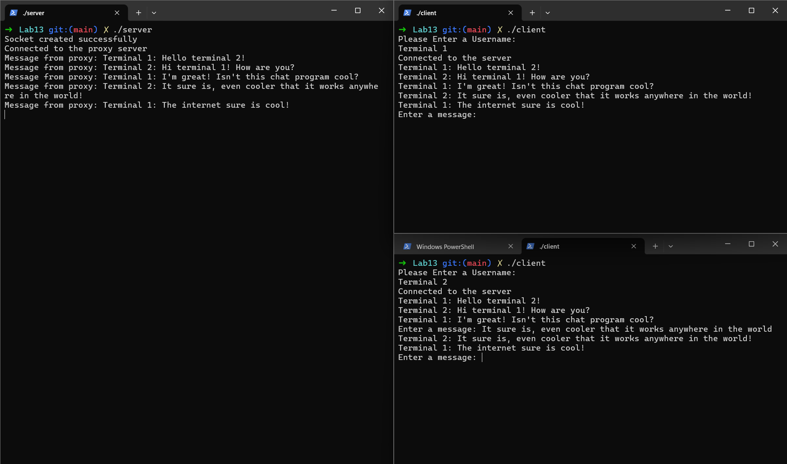

# Chat Application (Mac and Chance)

This application written in C (with a subcomponent in NodeJS) allows for a large scale chat room with large numbers of clients and allows everyone to chat at the same time (internet connection required).

## Usage

To use the application, one device needs to run the ./server code, which will allow users to connect to their device as clients. In another terminal or on different devices, users should run the ./client executable and enter a username. This username may contain spaces and identifies the users messages in the chat program. After this, the user is free to type any message they would like and communicate with other clients connected to the chat application.

** Additionally a publicly accessible NodeJS server must be running the server.js program for clients and the server to communicate. More information on this in the Networking Implementation section.

## Networking Implementation

This project uses TCP connections to allow for communication between different linux hosts. This would be an issue for users in a WSL environment and on most interprise network users do not have the ability to accept incoming connections or port forward out of the network due to security issues. To get around this, the program uses a proxy server out on the internet to forward traffic between hosts and the servers. The basic structure is that the clients will connect to a port on the remote NodeJS server and establish a TCP connection. They will then send their traffic over this connection. Meanwhile the ./server code will have established a connection with the proxy server on a different port, allowing the proxy to send messages from the clients over to the server. This helps avoid issues with both NAT Translation and Port Forwarding on the server side. This implementation also allows the application to function anywhere there is internet!